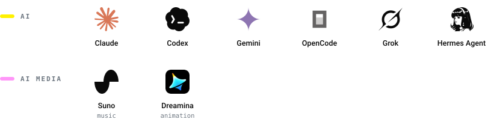
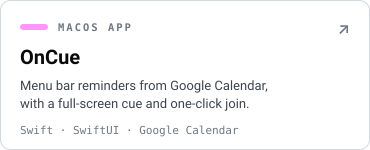
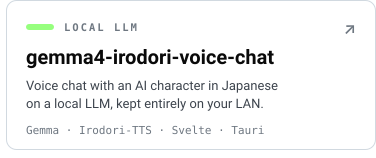
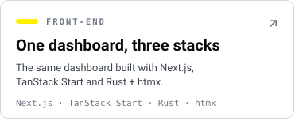
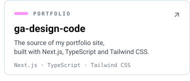

<picture>
  <source media="(prefers-color-scheme: dark)" srcset="./assets/header-dark.svg">
  
</picture>

  <a href="https://www.genta-ameku.com"><b>Portfolio</b></a>
  &nbsp;·&nbsp;
  <a href="https://github.com/GentaAmeku?tab=repositories">Repositories</a>
  &nbsp;·&nbsp;
  <a href="https://www.16personalities.com/ja/infj%E5%9E%8B%E3%81%AE%E6%80%A7%E6%A0%BC">INFJ-A</a>

## About

I'm Genta, a freelance engineer in Japan 🇯🇵.
I help teams adopt generative AI and AI-driven development, building on years of front-end tech-lead work with React, Next.js and TypeScript.

- **Now** — AI enablement: agent workflows with Claude Code and Codex, and the tools around them
- **Foundation** — front-end architecture, design systems and performance
- **On the side** — local LLMs and macOS apps for meetings in Swift ([OnCue](https://github.com/GentaAmeku/OnCue), [MeetingRecorder](https://github.com/GentaAmeku/MeetingRecorder))

## Tech

<picture>
  <source media="(prefers-color-scheme: dark)" srcset="./assets/tech-dark.svg">
  
</picture>

## Featured

<a href="https://github.com/GentaAmeku/ai-handout-studio"><picture><source media="(prefers-color-scheme: dark)" srcset="./assets/card-ai-handout-studio-dark.svg"></picture></a><a href="https://github.com/GentaAmeku/OnCue"><picture><source media="(prefers-color-scheme: dark)" srcset="./assets/card-oncue-dark.svg"></picture></a>
<a href="https://github.com/GentaAmeku/MeetingRecorder"><picture><source media="(prefers-color-scheme: dark)" srcset="./assets/card-meetingrecorder-dark.svg"></picture></a><a href="https://github.com/GentaAmeku/gemma4-irodori-voice-chat"><picture><source media="(prefers-color-scheme: dark)" srcset="./assets/card-gemma4-irodori-voice-chat-dark.svg"></picture></a>
<a href="https://github.com/GentaAmeku/dashboard-playground-nextjs"><picture><source media="(prefers-color-scheme: dark)" srcset="./assets/card-dashboard-three-stacks-dark.svg"></picture></a><a href="https://github.com/GentaAmeku/ga-design-code"><picture><source media="(prefers-color-scheme: dark)" srcset="./assets/card-ga-design-code-dark.svg"></picture></a>

The dashboard in each stack: [Next.js](https://github.com/GentaAmeku/dashboard-playground-nextjs) · [TanStack Start](https://github.com/GentaAmeku/dashboard-playground-tanstack-start) · [Rust + htmx](https://github.com/GentaAmeku/rust-htmx-dashboard)

**Also** — [dj-music-organizer](https://github.com/GentaAmeku/dj-music-organizer) sorts DJ tracks by BPM and key · [nextjs-dashboard-training](https://github.com/GentaAmeku/nextjs-dashboard-training) is a hands-on Next.js course I wrote

## Contributions

<picture>
  <source media="(prefers-color-scheme: dark)" srcset="https://raw.githubusercontent.com/GentaAmeku/GentaAmeku/output/github-contribution-grid-snake-dark.svg">
  
</picture>
